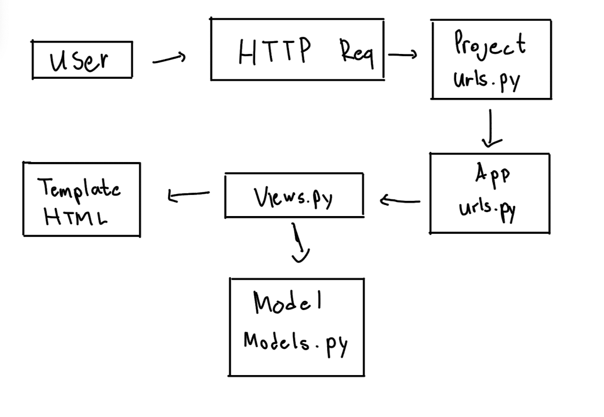
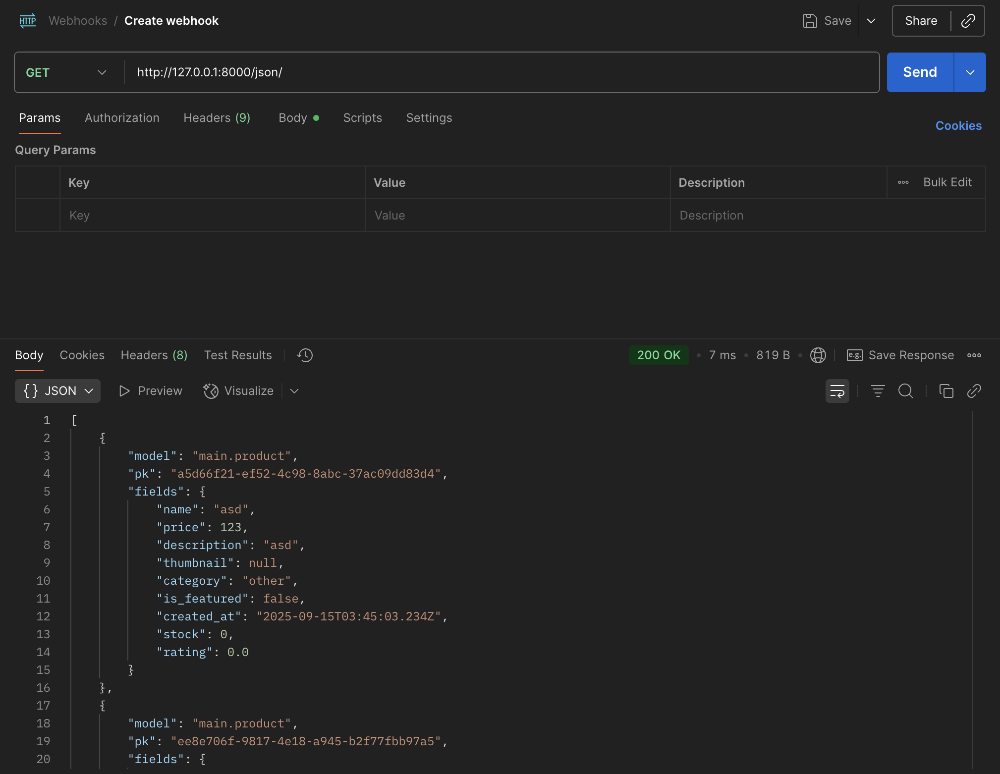
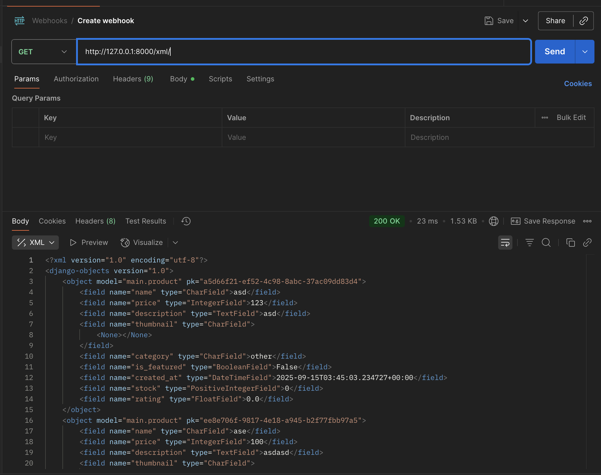
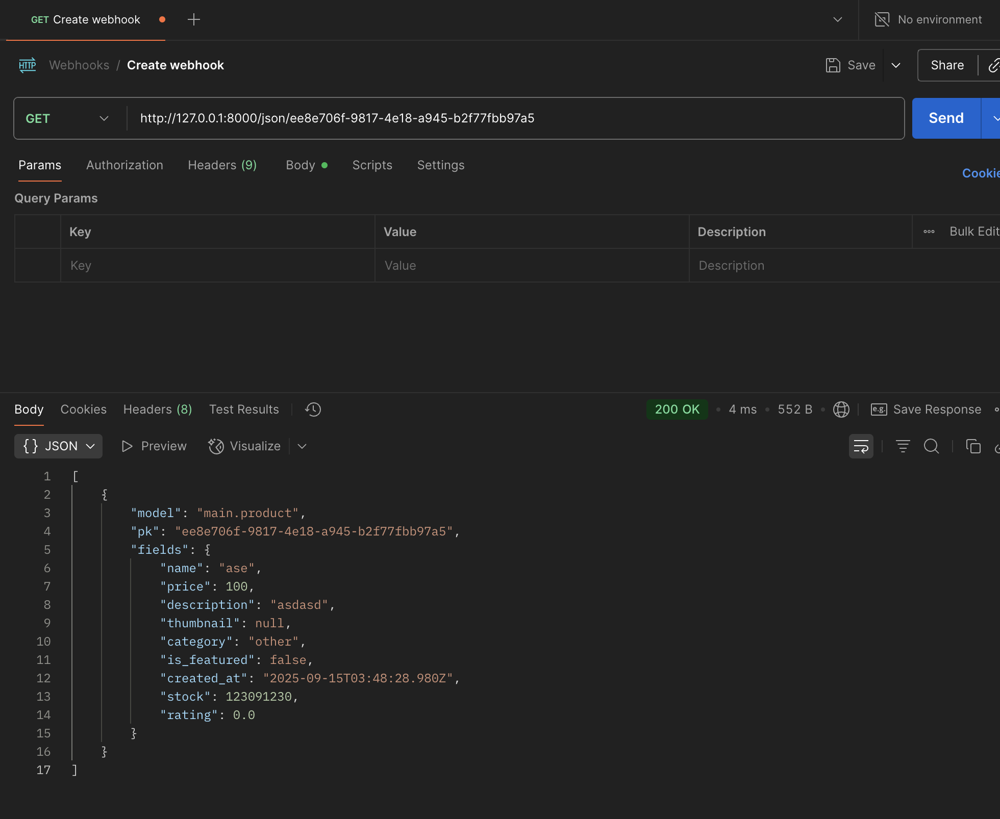
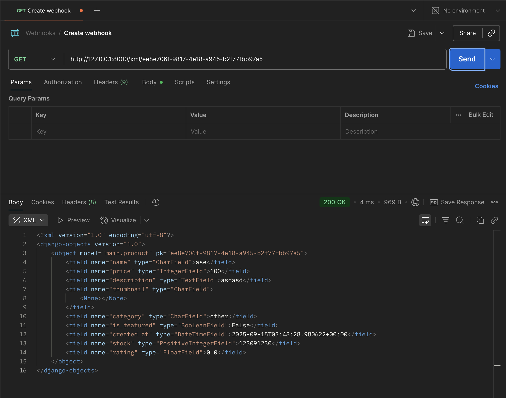

# Tugas PBP Django

## Identitas
- **Nama**: Muhammad Azzam Fathurrahman  
- **NPM**: 2406412152  
- **Kelas**: C  
- **Link PWS**: [muhammad-azzam42-thecorner.pbp.cs.ui.ac.id](https://muhammad-azzam42-thecorner.pbp.cs.ui.ac.id/)

---

# Tugas 2 - Pengenalan Django

## Implementasi Checklist
1. Membuat proyek Django baru dengan `django-admin startproject`.
2. Membuat aplikasi `main` dengan `python manage.py startapp main` dan menambahkannya di `INSTALLED_APPS`.
3. Menambahkan routing di `urls.py` agar aplikasi `main` bisa diakses.
4. Membuat model `Product` dengan atribut: name, price, description, thumbnail, category, is_featured, stock, rating.
5. Membuat fungsi di `views.py` untuk menampilkan nama aplikasi dan identitas.
6. Membuat routing di `main/urls.py` untuk fungsi tersebut.
7. Deploy ke PWS sehingga aplikasi bisa diakses melalui link.

---

## Bagan Request–Response

---

## Jawaban Pertanyaan
1. **Peran settings.py**: pusat konfigurasi proyek (database, apps, middleware, dll).  
2. **Migrasi database**: `makemigrations` membuat file migrasi, `migrate` menerapkan ke database.  
3. **Kenapa Django dipilih**: mudah dipahami (pakai Python), konsep MVT jelas, fitur bawaan lengkap, dokumentasi bagus.  
4. **Feedback asisten**: sudah baik.  

---

# Tugas 3 - Data Delivery & Form

## Implementasi Checklist
1. Menambahkan **empat fungsi views**: XML, JSON, XML by ID, JSON by ID.  
2. Menambahkan routing URL untuk masing-masing views.  
3. Membuat halaman utama dengan tombol **Add** (form) dan **Detail** (halaman detail).  
4. Membuat halaman form menggunakan `ModelForm`.  
5. Membuat halaman detail objek.  
6. Menjawab pertanyaan pada README.  
7. Mengakses endpoint dengan Postman dan menambahkan screenshot.  
8. Melakukan add-commit-push ke GitHub.  

---

## Bagan Request–Response

---

## Jawaban Pertanyaan
1. **Data delivery**: agar data dari server bisa dikirim ke client dengan format standar.  
2. **JSON vs XML**: JSON lebih populer karena ringan, mudah dibaca, cepat diproses.  
3. **is_valid()**: memeriksa validasi form sebelum data disimpan.  
4. **csrf_token**: melindungi dari serangan CSRF, tanpa ini form bisa dimanfaatkan penyerang.  
5. **Step by step**: buat views → routing → halaman index + tombol → form → detail → test di Postman → push ke GitHub.  
6. **Feedback**: sudah baik, penjelasan jelas.  

---

## Screenshot Postman
> (Tambahkan screenshot hasil uji endpoint JSON, XML, JSON by ID, XML by ID di sini)  

- JSON Endpoint:   
- XML Endpoint:   
- JSON by ID Endpoint:   
- XML by ID Endpoint:   

---

## Link Repository
[GitHub Repository Tugas](https://github.com/username/nama-repo)
